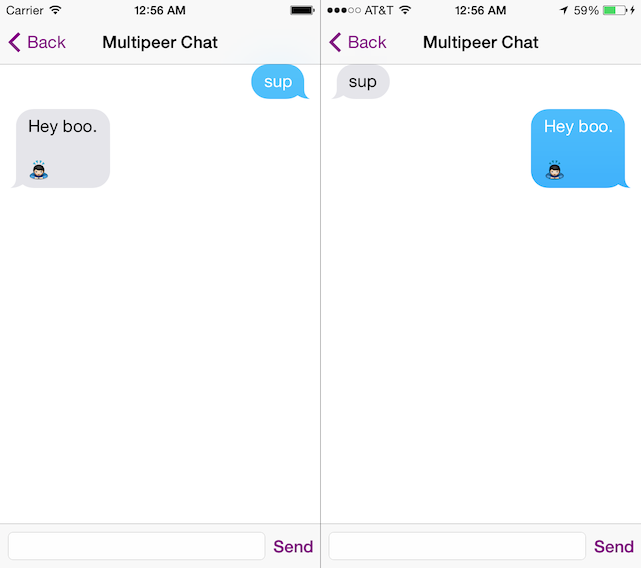

### MultipeerClientServer ###

##### What is it? #####

[MultipeerClientServer](https://github.com/mstultz/MultipeerClientServer "MultipeerClientServer") is a library that establishes a client-server network model built upon Apple's [Multipeer Connectivity](https://developer.apple.com/library/ios/documentation/MultipeerConnectivity/Reference/MultipeerConnectivityFramework/Introduction/Introduction.html "MultipeerConnectivity") and Apache's [Thrift](https://github.com/apache/thrift "Thrift") frameworks. Using Multipeer Connectivity, iOS devices can connect local peers using Wi-Fi networks, peer-to-peer Wi-Fi, and Bluetooth personal area networks. Peers can take on the role of a server and service clients through remote procedure calls via Thrift, providing an authoritative centralization of data and functionality. Thrift allows developers to establish client-server interoperability by generating code through a simple [Interface Definition Language](http://thrift.apache.org/docs/idl "Interface Definition Language").

##### Installation #####

MultipeerClientServer depends on [CocoaPods](http://cocoapods.org "CocoaPods"). It uses a private pod called [MSMessaging](https://github.com/mstultz/MSMessaging "MSMessaging"). Instructions on using private pods and private Spec Repos can be found on the [CocoaPods website](http://guides.cocoapods.org/making/private-cocoapods.html "CocoaPods website"). The private Spec Repo for MSMessaging can be found here:  [https://github.com/mstultz/Specs](https://github.com/mstultz/Specs "https://github.com/mstultz/Specs").

##### Licensing #####

Please see the file called LICENSE.
